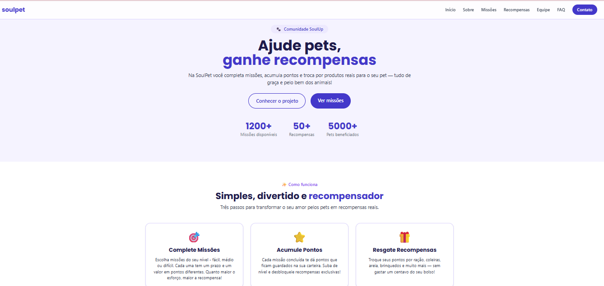
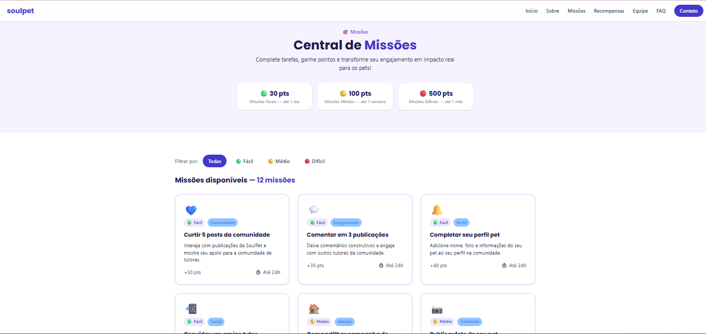
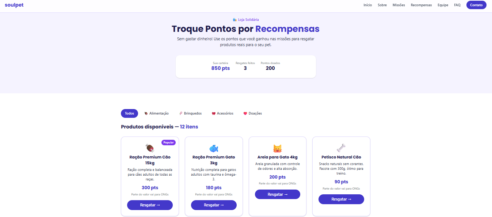
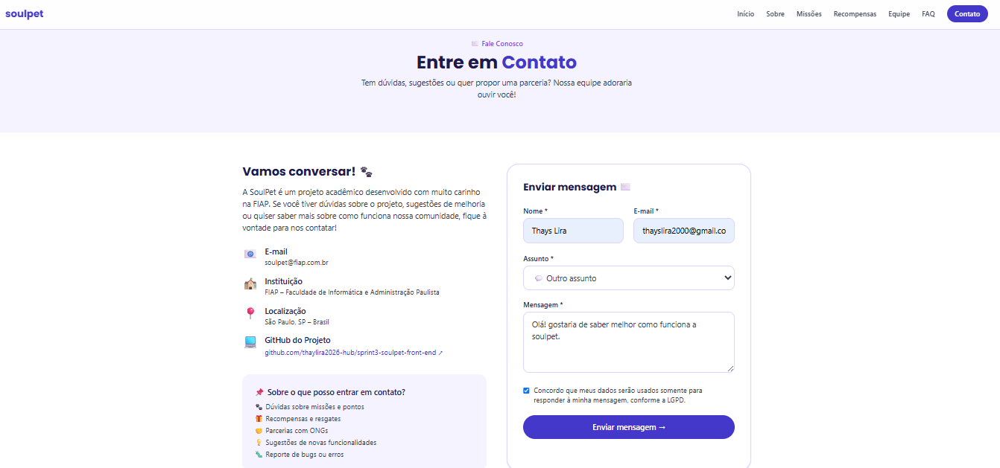

<div align="center">


### Gamificação para o bem-estar animal

Plataforma onde tutores de pets completam missões, acumulam pontos e trocam por recompensas reais ou doações a ONGs parceiras.


</div>

---

## 📖 Sobre o projeto

O **SoulPet** é uma comunidade dentro da rede social **SoulUp**, focada no bem-estar animal. Nela, tutores de pets completam missões, acumulam pontos e trocam por produtos reais para seus animais — ou doam esses pontos para ONGs de proteção animal.

Este repositório contém a versão **React + Vite + TypeScript** do projeto, desenvolvida para o **Challenge FIAP — 2º Semestre 2026**, na disciplina de Front-End Design Engineering (Sprint 03), migrando a aplicação original em HTML/CSS/JS para uma SPA moderna.

## ✨ Funcionalidades

- 🎯 **Missões** com 3 níveis de dificuldade, filtráveis por categoria
- 🎁 **Loja de recompensas** com filtro por categoria de produto
- 📄 **Páginas de detalhe** de missões e recompensas (rotas dinâmicas)
- 📊 **Contador animado** de estatísticas na Home
- ❓ **FAQ em accordion** interativo
- ✉️ **Formulário de contato** com validação em tempo real
- 📱 **Totalmente responsivo** (mobile, tablet e desktop)

## 📸 Capturas de tela

<div align="center">

### 🏠 Home


### 🎯 Missões


### 🎁 Recompensas


### ✉️ Contato


</div>

## 🚀 Tecnologias utilizadas

| Tecnologia | Finalidade |
|---|---|
| ⚛️ **React** | Construção da interface e componentização |
| ⚡ **Vite** | Build tool e servidor de desenvolvimento |
| 🔷 **TypeScript** | Tipagem estática e segurança do código |
| 🎨 **Tailwind CSS** | Estilização utilitária e responsiva |
| 🧭 **React Router DOM** | Navegação SPA e rotas dinâmicas |
| 📋 **React Hook Form** | Validação do formulário de contato |

## 📁 Estrutura de pastas

```
src/
├── components/     # Componentes reutilizáveis (Header, Footer, Cards, etc.)
├── pages/          # Páginas da aplicação (Home, Sobre, Missões, etc.)
├── data/           # Dados centralizados (missões, recompensas, equipe, FAQ)
├── App.tsx         # Configuração das rotas
├── main.tsx        # Ponto de entrada da aplicação
└── index.css       # Configuração do Tailwind e design tokens
```

## 💻 Como executar localmente

```bash
# 1. Clone o repositório
git clone https://github.com/thaylira2026-hub/sprint3-soulpet-front-end.git

# 2. Entre na pasta do projeto
cd sprint3-soulpet-front-end

# 3. Instale as dependências
npm install

# 4. Rode o projeto em ambiente de desenvolvimento
npm run dev
```

Acesse `http://localhost:5173` no navegador. 🎉

## 🔗 Repositório

🔗 [github.com/thaylira2026-hub/sprint3-soulpet-front-end](https://github.com/thaylira2026-hub/sprint3-soulpet-front-end)

## 👥 Integrantes

| Foto | Nome | RM | GitHub | LinkedIn |
|---|---|---|---|---|
|  | Bianca Pereira da Silva | 571077 | [@biancapereirasilva](https://github.com/biancapereirasilva) | [🔗 LinkedIn](https://www.linkedin.com/in/bianca-pereira-866845213/) |
|  | Isabelle Souza Lima Pires Araujo | 569370 | [@isasouzz](https://github.com/isasouzz) | [🔗 LinkedIn](https://www.linkedin.com/in/isabelle-souza-9342a027a/) |
|  | Maria Eduarda Cavallari Quarelo | 570462 | [@dudaquarelo](https://github.com/dudaquarelo) | [🔗 LinkedIn](https://www.linkedin.com/in/maria-eduarda-quarelo-678a0840a/?skipRedirect=true) |
|  | Thays Lira de Oliveira | 568799 | [@thaylira2026-hub](https://github.com/thaylira2026-hub) | [🔗 LinkedIn](https://www.linkedin.com/in/thays-lira-538619186/) |

🎓 **Turma:** 1TDSR-2026 · FIAP — Análise e Desenvolvimento de Sistemas

## 📩 Contato

Dúvidas ou sugestões sobre o projeto? 📧 **soulpet@fiap.com.br**

---

<div align="center">

Feito com 💜 pela equipe SoulPet

</div>
